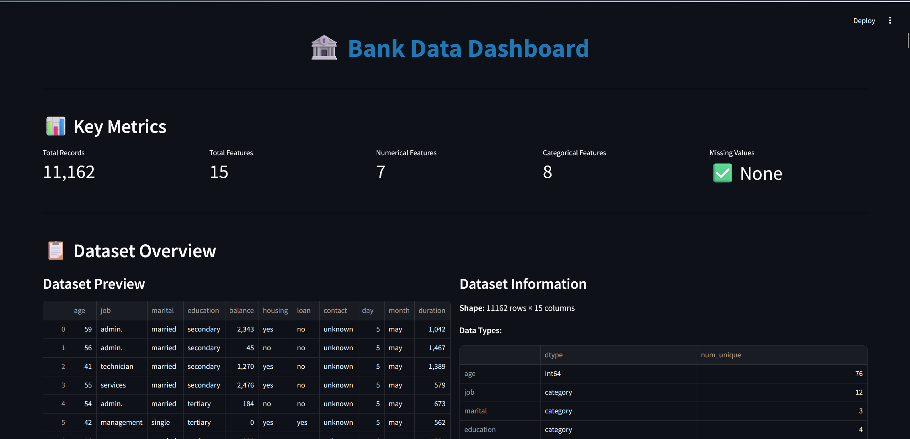
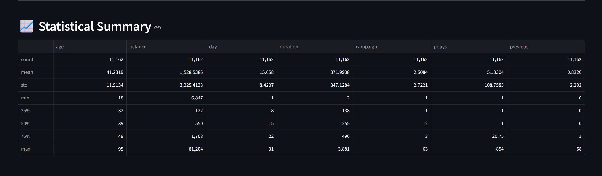
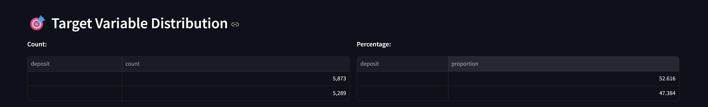
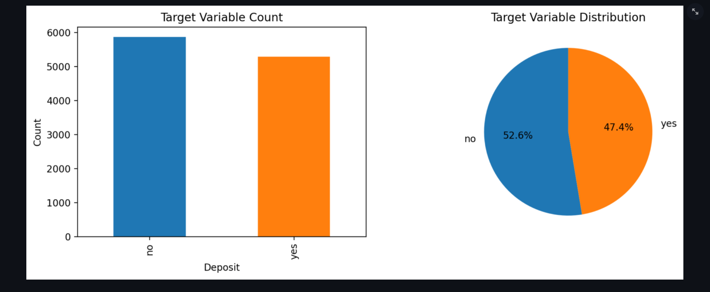
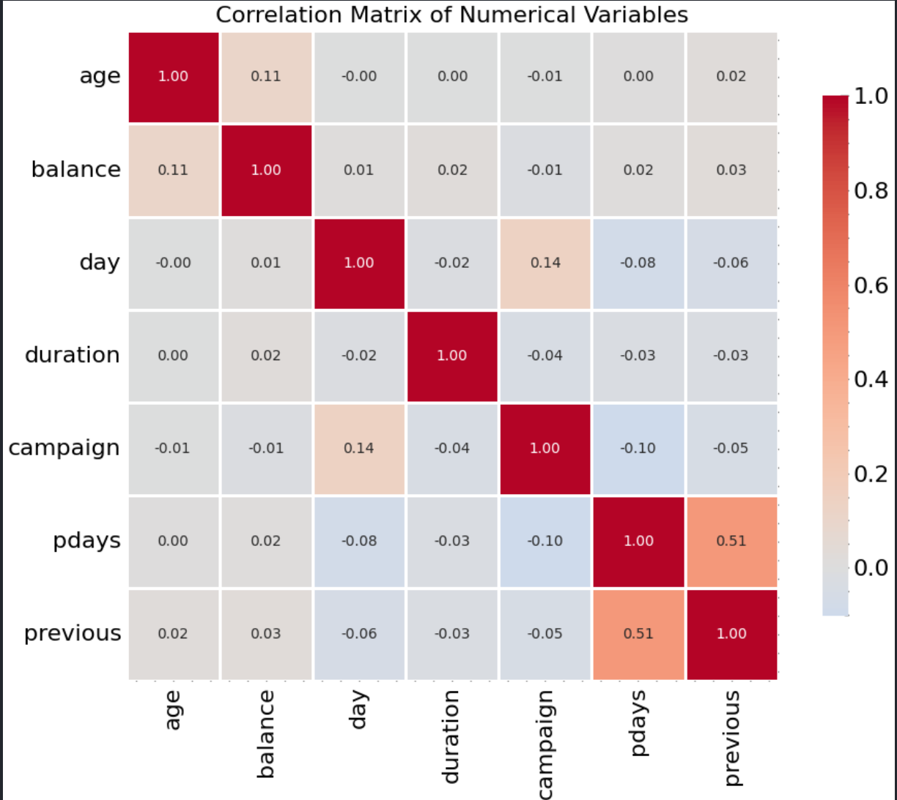

# Bank Data Analysis Dashboard

[Click Here to Access Dashboard](https://mahmouddtahaa-bank-data-dashboard-app-blvcko.streamlit.app/)



## 📋 Table of Contents

- [Project Overview](#project-overview)
- [Dataset Description](#dataset-description)
- [Project Structure](#project-structure)
- [Exploratory Data Analysis](#exploratory-data-analysis)
- [Results & Findings](#results--findings)
- [Streamlit Dashboard](#streamlit-dashboard)
- [Future Improvements](#future-improvements)

## 🎯 Project Overview

This project provides a comprehensive analysis of bank customer data to understand patterns and relationships related to term deposit subscriptions. The project includes an interactive dashboard for data exploration and visualization.

**Key Objectives:**

- Analyze bank customer data to understand patterns and relationships
- Create an interactive dashboard for data exploration
- Provide insights for bank marketing strategies
- Visualize key metrics and feature distributions

## 📊 Dataset Description

### Dataset Information

- **Dataset Name:** Bank Marketing Dataset
- **Total Records:** 11,162
- **Total Features:** 15 (7 numerical, 8 categorical)
- **Target Variable:** `deposit` (yes/no)
- **Data Source:** Bank marketing campaign data

### Feature Description

#### Numerical Features:

1. **age** - Customer age (18-100)
2. **balance** - Account balance (can be negative)
3. **day** - Day of month when contacted (1-31)
4. **duration** - Last contact duration in seconds
5. **campaign** - Number of contacts performed during this campaign
6. **pdays** - Number of days since last contact (-1 means not previously contacted)
7. **previous** - Number of contacts performed before this campaign

#### Categorical Features:

1. **job** - Type of job (admin, technician, services, etc.)
2. **marital** - Marital status (married, single, divorced)
3. **education** - Education level (primary, secondary, tertiary, unknown)
4. **housing** - Has housing loan? (yes/no)
5. **loan** - Has personal loan? (yes/no)
6. **contact** - Contact communication type (cellular, telephone, unknown)
7. **month** - Last contact month of year
8. **deposit** - Target variable - Has the customer subscribed to a term deposit? (yes/no)

### Dataset Statistics

- **No Missing Values:** ✅ Clean dataset
- **Class Distribution:**
  - Deposit: Yes - ~55%
  - Deposit: No - ~45%
- **Data Quality:** High quality with no duplicates after preprocessing



## 📁 Project Structure

```
assignments/
│
├── notebooks/
│   └── bank_data_analysis.ipynb   # Complete data analysis notebook
│
├── preprocessing_utils/
│   ├── __init__.py
│   └── preprocessing_utils.py    # Utility functions for data preprocessing
│
├── app.py                         # Interactive Streamlit dashboard
├── requirements.txt               # Python dependencies
└── README.md                      # Project documentation
```

## 📈 Exploratory Data Analysis

### Key Findings

#### 1. Target Variable Distribution

- The dataset is relatively balanced with a slight majority of customers subscribing to deposits
- This balance allows for effective model training without severe class imbalance issues





#### 2. Numerical Features Analysis

**Age Distribution:**

- Most customers are between 30-50 years old
- Normal distribution with slight right skew

**Balance Distribution:**

- Highly skewed distribution with many customers having low or negative balances
- Few customers have very high balances (outliers present)

**Duration:**

- Strong indicator of deposit subscription
- Longer call durations correlate with higher subscription rates

#### 3. Categorical Features Analysis

**Job Type:**

- Admin, blue-collar, and technician jobs are most common
- Job type shows correlation with deposit subscription

**Marital Status:**

- Married customers form the majority
- Single customers show different subscription patterns

**Education:**

- Tertiary education level is most common
- Education level influences subscription behavior

#### 4. Feature Correlations

**Key Correlations:**

- `duration` shows strong positive correlation with deposit subscription
- `pdays` and `previous` are correlated (both related to previous campaign contacts)
- `age` and `balance` show moderate correlation



#### 5. Feature vs Target Relationships

**Important Insights:**

- **Duration:** Customers with longer call durations are more likely to subscribe
- **Age:** Middle-aged customers (30-50) show higher subscription rates
- **Housing Loan:** Customers without housing loans are more likely to subscribe
- **Contact Type:** Cellular contacts show different patterns than telephone contacts

## 📊 Results & Findings

### Key Insights

1. **Target Variable Distribution:**

   - The dataset is relatively balanced with a slight majority of customers subscribing to deposits
   - This balance allows for effective analysis without severe class imbalance issues

2. **Most Important Features:**
   - `duration` - Most critical feature for understanding subscription patterns
   - `age` - Significant predictor of customer behavior
   - `balance` - Important for understanding customer financial status
   - `pdays` - Previous contact information matters
   - `campaign` - Number of contacts influences outcome

## 🌐 Streamlit Dashboard

### Features

The interactive Streamlit dashboard provides a comprehensive one-page view of the bank data:

1. **📊 Key Metrics**

   - Total records, features, and data quality metrics
   - Quick overview of dataset characteristics

2. **📋 Dataset Overview**

   - Dataset preview and information
   - Data types and missing values analysis

3. **🎯 Target Variable Distribution**

   - Count and percentage distributions
   - Visual charts (bar and pie)

4. **📈 Statistical Summary**

   - Descriptive statistics for all numerical features

5. **🔢 Numerical Features Analysis**

   - Interactive selection of numerical columns
   - Histogram, KDE plot, and boxplot visualizations

6. **📊 Categorical Features Analysis**

   - Interactive selection of categorical columns
   - Count plots and pie charts

7. **🔗 Correlation Analysis**

   - Correlation matrix heatmap for numerical variables

8. **🎯 Feature vs Target Analysis**

   - Analysis of relationships between features and target variable
   - Boxplots for numerical features
   - Cross-tabulation heatmaps for categorical features

9. **📄 Full Dataset Table**
   - Complete dataset view with filtering capabilities

## 🔍 Business Insights

### Marketing Strategy Recommendations

1. **Focus on Call Duration:**

   - Longer conversations lead to higher conversion rates
   - Train agents to engage customers effectively

2. **Target Age Group:**

   - Focus marketing efforts on customers aged 30-50
   - This demographic shows highest subscription rates

3. **Contact Timing:**

   - Consider timing of contacts (month, day)
   - Some months show better conversion rates

4. **Customer Segmentation:**

   - Customers without housing loans are better prospects
   - Job type and education level matter for targeting

5. **Campaign Management:**
   - Limit number of contacts per customer
   - Previous contact history is important

## 🚀 Future Improvements

### Potential Enhancements

1. **Dashboard Enhancements:**

   - Export visualizations to images
   - Export filtered data to CSV
   - Real-time data updates
   - Advanced filtering options
   - Custom date range selection

2. **Analysis Enhancements:**

   - Advanced feature engineering visualizations
   - Outlier detection and visualization
   - Interactive drill-down capabilities

Thank You
